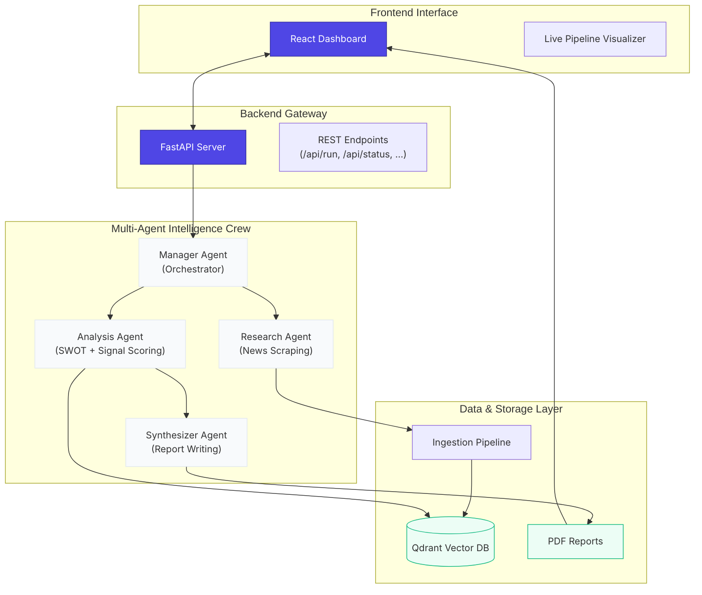

# 🏢 Multi-Agent Competitive Intelligence System

> **Transforming raw web data into strategic insights.** An autonomous AI-powered platform that continuously monitors competitor activity, performs deep strategic analysis, and generates professional executive reports — all controlled from a stunning real-time dashboard.

<p align="center">
  
  
  
  
  
</p>

---

## 🚀 Overview

This system deploys a high-performance **Crew of specialized AI agents** that work in concert to deliver boardroom-ready competitive intelligence. With a single click, the agents swarm the web, synthesize massive datasets, and produce structured PDF reports featuring SWOT analyses, weak signal detection, and actionable strategic recommendations.

**🎯 Focused Tracking:** `OpenAI` • `Google DeepMind` • `Meta AI` • `Anthropic`

---

## 📱 Dashboard Overview

| Feature | Description |
|:---|:---|
| **📊 Dashboard** | Live stats — articles collected, signals detected, vectors stored, run history |
| **⚡ Live Pipeline** | Animated 6-stage pipeline visualizer with real-time log terminal |
| **🤖 Agent Activity** | All 5 agents with roles, tools, status, and last activity timestamps |
| **🔍 Intelligence** | Per-company SWOT analysis, sentiment momentum, signal velocity chart |
| **🌐 Signal Graph** | D3 force-directed network graph of companies, topics, and signal relationships |
| **📄 Reports** | PDF download, inline report preview, SWOT summary, key developments |
| **💾 Data Store** | All collected articles, vector DB stats, search and filter |

---

## System Architecture



---

## 👥 Agent Roles

| Agent | Responsibility | Key Capabilities |
|:---|:---|:---|
| **Manager Agent** | Chief Intelligence Officer | CrewAI orchestration, task delegation, hierarchical oversight |
| **Research Agent** | Intelligence Collector | Deep web scraping, Serper.dev integration, multi-competitor tracking |
| **Analysis Agent** | Strategy Analyst | SWOT framework, semantic RAG retrieval, weak signal scoring |
| **Synthesizer Agent** | Executive Writer | Multi-perspective synthesis, PDF compilation, strategic 30-day outlook |
| **Quality Guard** | Validation Engine | Pydantic data validation, automated error recovery, fallback logic |

---

## 🛠️ Tech Stack

#### 🖥️ Backend
- **Python 3.10+** — Core engine
- **CrewAI** — Multi-agent orchestration
- **LangChain + Mistral AI** — LLM reasoning & RAG
- **Qdrant Cloud** — High-performance vector database
- **FastAPI + Uvicorn** — Ultra-fast REST API
- **Sentence Transformers** — Local semantic embeddings
- **ReportLab** — Automated PDF generation

#### 🎨 Frontend
- **React 18 + Vite** — Modern UI framework
- **TailwindCSS** — Premium styling system
- **Chart.js + D3.js** — Interactive data visualizations
- **Lucide React** — Elegant iconography

---

## 📂 Project Structure

```bash
.
├── 🤖 agents/            # Specialized AI core logic
│   ├── analysis_agent.py   # RAG-based strategic analysis (SWOT)
│   ├── manager_agent.py    # CrewAI hierarchical orchestrator
│   ├── research_agent.py   # Multi-source intelligence gathering
│   └── synthesizer_agent.py# Executive summary & PDF compiler
├── ⚙️ config/            # System & Competitor configuration
│   ├── competitors.yaml    # Target companies & focus keywords
│   └── settings.py         # Global environment & API loader
├── 🚢 crew/              # CrewAI assembly
│   └── intelligence_crew.py# Agent/Task wiring and process flow
├── 💻 frontend/          # React + Vite Dashboard
│   ├── src/                # UI source code
│   └── dist/               # Production build (served by backend)
├── 📈 monitoring/        # Observability & Tracking
│   ├── logger.py           # Rich logging system
│   └── run_tracker.py      # Execution metrics & history
├── 🔄 pipelines/         # Data processing layers
│   ├── chunker.py          # Semantic text segmentation
│   ├── ingestion_pipeline.py# Scrape → Embed → Upsert flow
│   └── signal_detector.py  # Weak signal scoring & extraction
├── 📝 reports/           # Document generation
│   └── pdf_renderer.py     # Professional PDF layout system
├── 📦 storage/           # Database & Vector stores
│   ├── database.py         # Local JSON meta-store
│   └── vector_store.py     # Qdrant vector client
├── 🛠️ tools/             # Shared agent capabilities
│   ├── rag_tool.py         # Semantic retrieval engine
│   ├── scraper_tool.py     # Firecrawl web extraction
│   └── search_tool.py      # Serper.dev Google Intelligence
└── api_server.py           # FastAPI Application Entry
```

---

## ⚡ Quick Start

### 📋 Prerequisites
- Python 3.10+
- Node.js 18+
- Git

### 1. Clone the repository
```bash
git clone https://github.com/Subrahmanyeswar/multi-agent-competitive-intelligence.git
cd multi-agent-competitive-intelligence
```

### 2. Set up Python environment
```bash
python -m venv venv
venv\Scripts\activate        # Windows
# source venv/bin/activate   # Mac/Linux
pip install -r requirements.txt
```

### 3. Configure environment variables
```bash
cp .env.example .env
```

Open `.env` and fill in your API keys:

| Key | Where to get it | Free tier |
|---|---|---|
| `MISTRAL_API_KEY` | [console.mistral.ai](https://console.mistral.ai/) | Yes |
| `SERPER_API_KEY` | [serper.dev](https://serper.dev/) | 2500 searches/month |
| `FIRECRAWL_API_KEY` | [firecrawl.dev](https://firecrawl.dev/) | 500 pages/month |
| `QDRANT_URL` + `QDRANT_API_KEY` | [cloud.qdrant.io](https://cloud.qdrant.io/) | 1GB free |

### 4. Configure competitors

Edit `config/competitors.yaml` to track the companies you want:
```yaml
competitors:
  - name: "OpenAI"
    domain: "openai.com"
    keywords: ["OpenAI", "ChatGPT", "GPT-4o"]
    categories: ["product", "partnership", "funding"]
```

### 5. Build and run
```bash
# Windows — double-click or run:
.\start.bat

# Manual start:
cd frontend && npm install && npm run build && cd ..
python main.py
```

Open **http://localhost:8000** in your browser.

### 6. Generate your first report

Click **Run Pipeline** in the dashboard. The system will:
1. Scrape latest news for all competitors
2. Chunk and embed articles into Qdrant
3. Run SWOT + signal analysis via Mistral AI
4. Generate a PDF competitive intelligence report

Full run takes approximately **5–10 minutes** on free API tiers.

---

## Report Output

Each pipeline run produces:
- **PDF report** with executive summary, SWOT analysis, key developments, weak signals, strategic recommendations, and 30-day outlook
- **JSON analyses** stored in `storage/analyses.json`
- **Run history** logged in `storage/run_history.json`

---

## Configuration

### Adding new competitors

Edit `config/competitors.yaml`:
```yaml
competitors:
  - name: "Anthropic"
    domain: "anthropic.com"
    keywords: ["Anthropic", "Claude", "Constitutional AI"]
    categories: ["product", "research", "funding"]
```

### Changing the LLM model

In `.env`:
MISTRAL_MODEL=mistral-large-latest   # More accurate, slower
MISTRAL_MODEL=mistral-small-latest   # Faster, good for free tier

### Scheduling weekly runs
```bash
python main.py --schedule
```
Runs every Monday at 08:00 automatically.

---

## API Endpoints

| Method | Endpoint | Description |
|---|---|---|
| `POST` | `/api/run` | Trigger pipeline run |
| `GET` | `/api/status` | Current pipeline status |
| `GET` | `/api/competitors` | All tracked competitors + stats |
| `GET` | `/api/articles` | Collected articles (filter by company) |
| `GET` | `/api/signals` | Weak signal detection results |
| `GET` | `/api/analyses` | Latest SWOT analyses |
| `GET` | `/api/report/latest` | Latest report metadata |
| `GET` | `/api/report/download` | Download latest PDF report |
| `GET` | `/api/vector-stats` | Qdrant vector DB statistics |
| `GET` | `/api/runs` | Full run history |

Full API docs available at **http://localhost:8000/docs**

---

## Important Notes

- **Free tier safe** — designed to work within free API limits
- **Rate limiting handled** — automatic retry with exponential backoff
- **No data committed** — `.env` and `storage/` are gitignored
- **Lazy loading** — heavy AI libraries load only when pipeline runs

---

## ⚖️ License

MIT License — see [LICENSE](LICENSE) for details.

---

## 👨‍💻 Author

**Subrahmanyeswar Kolluru**

- **HuggingFace:** [@Subrahmanyeswar](https://huggingface.co/Subrahmanyeswar)
- **LinkedIn:** [Subrahmanyeswar Kolluru](https://www.linkedin.com/in/subrahmanyeswar-kolluru-914694293)

*Built with passion and cutting-edge AI orchestration.*

---
